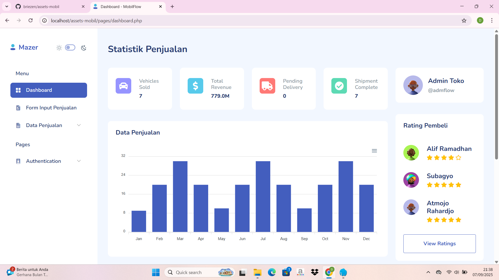
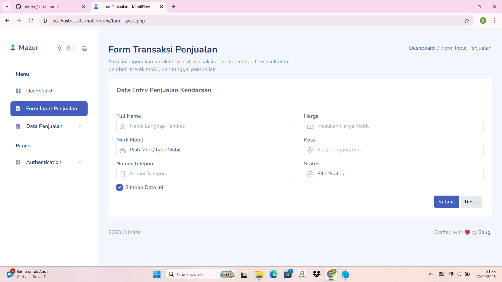
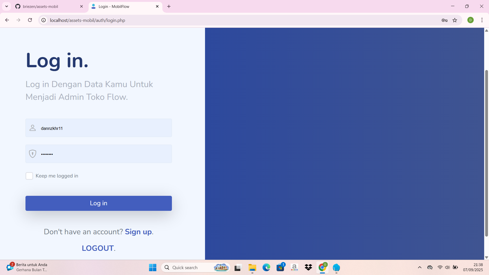
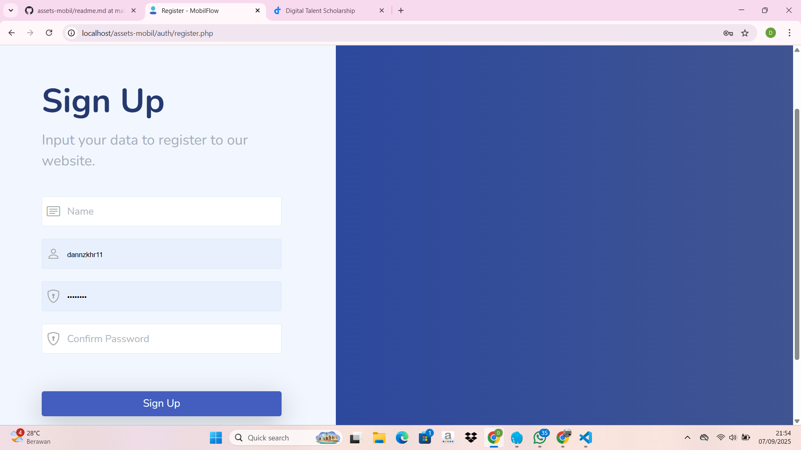

# 🚗 Assets Mobil

[](https://www.php.net/)  
[](https://getbootstrap.com/)  
[](https://developer.mozilla.org/docs/Web/JavaScript)  
[](https://github.com/zuramai/mazer)  
[](#license)  
[](#author)

Website berbasis template **Mazer**—free, open-source Bootstrap 5 Admin Dashboard—untuk pemenuhan **Ulangan Kenaikan Kelas XI RPL**, guna pencatatan penjualan mobil di showroom.

## ✨ Features
- 📊 Dashboard interaktif
- 📝 Form input penjualan mobil
- 📑 Tabel data penjualan
- 🔐 Login & Register

## 📌 Deskripsi Singkat

- **index.php** : Halaman utama website.  
- **login.php** : Halaman login user.  
- **register.php** : Halaman registrasi user.  
- **dashboard.php** : Halaman dashboard setelah login.  
- **css/style.css** : File styling untuk project.  
- **js/app.js** : File JavaScript untuk interaktivitas.  
- **screenshots/** : Folder berisi screenshot tampilan project.

## 📸 Screenshots

### Dashboard


### Form Input Penjualan


### Tabel Penjualan


### Login


### Register


## ⚙️ Installation

1. **Clone repository**
   ```bash
   git clone https://github.com/briezen/assets-mobil.git
   cd assets-mobil
   
2. Jalankan project (contoh dengan Laragon/XAMPP)

Letakkan folder di:

htdocs → untuk XAMPP
www → untuk Laragon

Akses melalui browser:
http://localhost/assets-mobil/auth/login.php

## 👨‍💻 Author

Dandi Gustaf Zakhir

