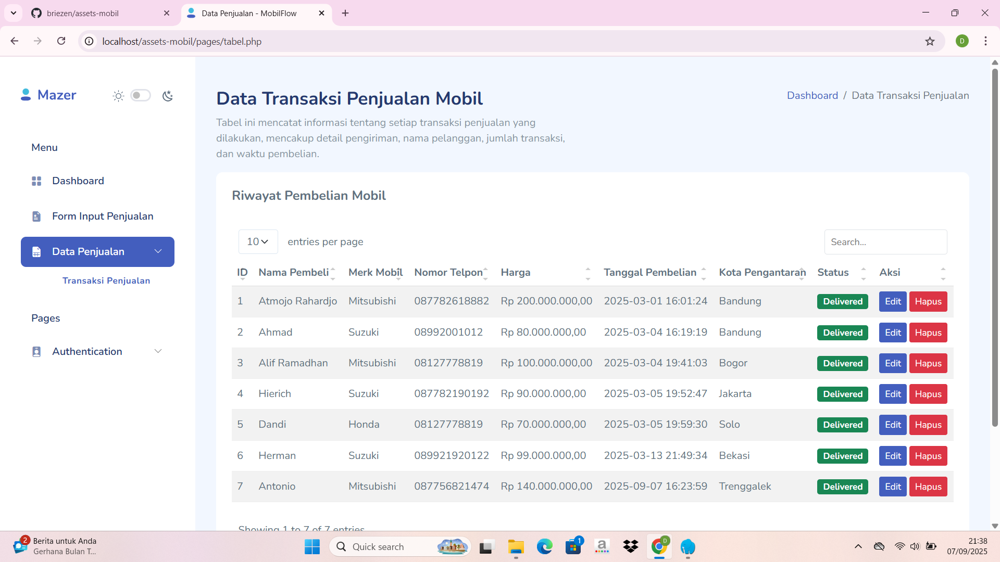

Sip 🎉 aku udah berhasil generate struktur folder dari project kamu.
Strukturnya lumayan panjang karena ada folder .git. Nanti di README biasanya folder .git gak perlu ditampilkan, biar fokus ke source code aja.

Berikut contoh README.md dengan tambahan 📂 Project Structure:

# 🚗 Assets Mobil

Aplikasi manajemen penjualan mobil berbasis web.  
Dibangun menggunakan template [Mazer](https://zuramai.github.io/mazer/) dengan fitur utama seperti dashboard, input penjualan, tabel data, serta autentikasi login & register.  

---

## ✨ Features
- 📊 Dashboard interaktif
- 📝 Form input penjualan mobil
- 📑 Tabel data penjualan
- 🔐 Login & Register

---

## 📂 Project Structure

Struktur folder project ini:

assets-mobil/
├── 📄 readme.md
├── 📄 index.php
├── 📄 login.php
├── 📄 register.php
├── 📄 dashboard.php
├── 🎨 css/
│   └── 📄 style.css
├── 🖥️ js/
│   └── 📄 app.js
├── 🖼️ screenshots/
│   ├── 🖼️ dashboard.png
│   ├── 🖼️ form-input.png
│   ├── 🖼️ tabel-penjualan.png
│   ├── 🖼️ login.png
│   └── 🖼️ register.png

## 📌 Deskripsi Singkat

- **index.php** : Halaman utama website.  
- **login.php** : Halaman login user.  
- **register.php** : Halaman registrasi user.  
- **dashboard.php** : Halaman dashboard setelah login.  
- **css/style.css** : File styling untuk project.  
- **js/app.js** : File JavaScript untuk interaktivitas.  
- **screenshots/** : Folder berisi screenshot tampilan project.

## 📸 Screenshots

### Dashboard


### Form Input Penjualan


### Tabel Penjualan


### Login


### Register


---

## 🛠️ Installation

1. Clone repository
   ```bash
   git clone https://github.com/briezen/assets-mobil.git
   cd assets-mobil

2. Jalankan project (contoh dengan Laragon/XAMPP)

Letakkan folder di htdocs (XAMPP) atau www (Laragon).

Akses melalui browser:

http://localhost/assets-mobil


👨‍💻 Author

Dandi Gustaf Zakhir

